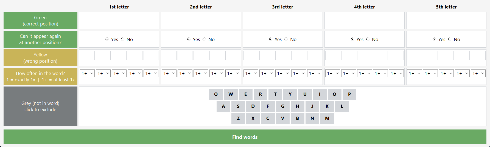
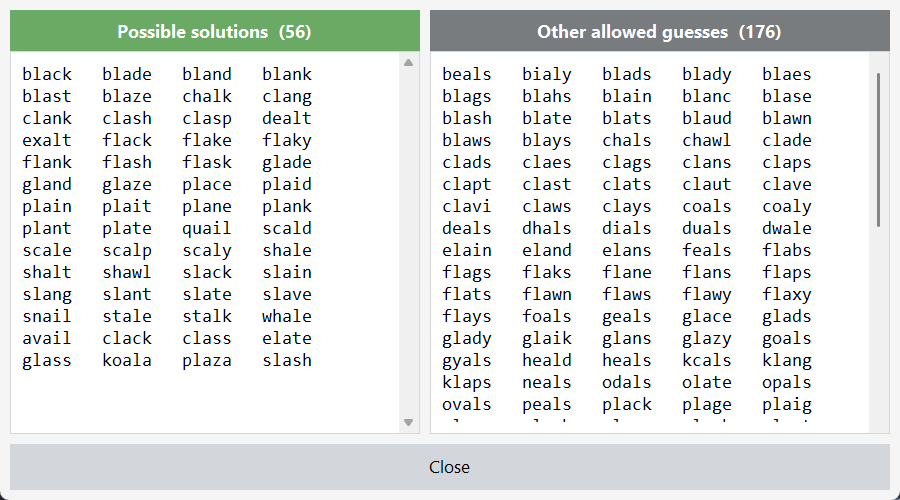

# Wordle-Solver

A desktop helper for [Wordle](https://www.nytimes.com/games/wordle). You enter what the game
told you about your guesses, and it lists every word that still fits.

## ⬇️ Download for Windows

### **[Download Wordle-Solver.exe](https://github.com/KarimBk7/Wordle-Solver/releases/latest/download/Wordle-Solver.exe)**

Double-click the downloaded file and the window below opens. There is nothing to install and you
do not need Python — everything is inside that one file.

Windows may warn you that the file is unknown ("Windows protected your PC"). That is because the
file is not signed, not because something is wrong with it. Click *More info* → *Run anyway*.



## Running it from source

Only needed if you want to change the code. Python 3.8 or newer, no dependencies, since Tkinter
ships with Python:

```
python main.py
```

On Linux, Tkinter is sometimes a separate package: `sudo apt install python3-tk`.

## How to use it

Each column is one letter position in the word. Fill in what the game showed you:

| Row | Meaning |
|---|---|
| **Green** | The letter is at this position. One letter per field. |
| **Can it appear again at another position?** | "No" if you know the letter occurs exactly once. |
| **Yellow** | Letters that are in the word but *not* at this position. Up to five per column. |
| **How often in the word?** | For each yellow letter: `1+` means at least once, `1` exactly once, `2+` at least twice, and so on. |
| **Grey (not in word)** | Click every letter the game greyed out. |

Then click **Find words**. The result window shows two lists:

- **Possible solutions** — the 2,315 words that can actually be the answer of the day.
- **Other allowed guesses** — words Wordle accepts as a guess but never uses as the answer.
  Useful when you want to burn a guess to test several letters at once.

Within each list, words with the most distinct letters come first, since those rule out the most
on your next guess.



### The "how often" row

This is the part that is easy to miss, and it is what makes the results precise. If you guess a
letter twice and only *one* of the two is coloured, the game has told you the letter occurs
exactly once. Set that field to `1`, and every word with two of that letter disappears from the
results.

## Word lists

The two lists are Wordle's own, taken from the game's source code, not from a general dictionary:

- [`words_answers.txt`](words_answers.txt) — 2,315 possible solutions
- [`words_guesses.txt`](words_guesses.txt) — 12,540 words that are accepted but never the answer

Sources: [cfreshman's gists](https://gist.github.com/cfreshman/a03ef2cba789d8cf00c08f767e0fad7b)
and [tabatkins/wordle-list](https://github.com/tabatkins/wordle-list).

## Building the .exe

```
py -m pip install pyinstaller
py -m PyInstaller --onefile --windowed --name Wordle-Solver ^
  --add-data "words_answers.txt;." --add-data "words_guesses.txt;." main.py
```

The result lands in `dist/`. On Linux or macOS, run the same command there and use `:` instead
of `;` in `--add-data`.

## Files

| File | Purpose |
|---|---|
| `main.py` | Entry point |
| `gui.py` | The Tkinter window and everything in it |
| `wordle.py` | The solver: filters both word lists against your input |
